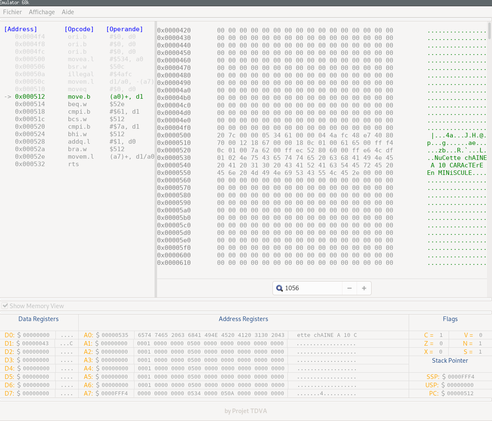

## Bienvenue sur le site officiel de notre projet
Nous sommes fières de vous présenter notre projet, un émulateur M68 k. Le code source n'est pas visible pour le moment. En effet le projet est encore en bêta. Si vous voulez proposer de nouvelles fonctionnalités, nésitez pas à utiliser [l'interface github](https://github.com/08A/08A.github.io/issues) de ce repository.


### Membre de ce projet
- [David Oiknine](https://github.com/davidoiknine)
- [Théo Perinet](https://github.com/TheoPeri)
- [Valentin Bordeianu](https://github.com/BlenMiner)
- [Alexis Ehret](https://github.com/08A/08A.github.io/issues)

### Installation

1. Téléchargement
```bash
git clone <url>
cd Emulator-68k/
```

2. Tests unitaires 
```bash
make unit_test
./target/build/unit_test
```

3. Build 
```bash
make exec
./target/build/exec
```

4. Build debug
```bash
make debug
./target/build/debug
```

### Interface


